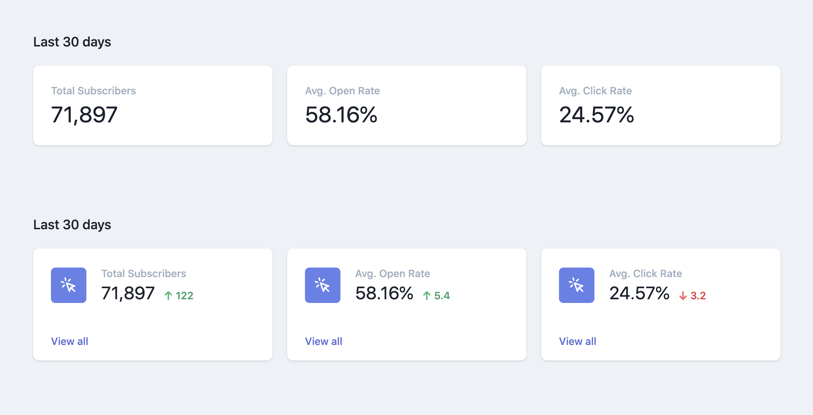

# Tailwind UI - Full-Stack Developer Application

Greetings from Burnsville, Minnesota, USA!

I'm Alexander Besse; but you can call me *Xander*. I'm transitioning careers from public safety to software engineering. I've finished Team Treehouse's Front-End and Full-Stack Techdegree courses. I am currently enrolled Lambda School, and working on the back-end development portion of Lambda School.

My GitHub can be found [here](https://github.com/AlexJoeb)!

> Tells us why we're a great fit for each other, and what you see the future being like if we work together.

The future? The future is filled with white sandy beaches and Piña Coladas, my friend.

All joking aside,  I truely believe that I would be a great fit for Tailwind UI because I've worked extensively in HTML, CSS, ES6 JavaScript, React (and React utilities), Node.JS, SQL (such as SQLite3) and NoSQL Databases (such as MongoDB), and the list goes on. Plus, I'm a very fast learner. I watch YouTube tutorials on 2x speed, no joke. This means something that I am less familiar with (such as Laravel for example) can be learned quickly at two times the speed.

I work great in small teams; Being someone who is more introverted than extroverted, I thrive with a smaller niche group of people who I can grow a stronger relationship with. I feel the relationship brings a comradery to the team and allows communcation and work to happen more efficiently. Also, I'm someone who enjoys learning at least a little bit about each craft; Therefore, I would work well in an enviroment as someone who "wears a lot of hats".

This position would be a great fit for me because I live in Central Standard Time. Given only the one hour time difference, I would be able to spend the entire work day being in communication with the team. Being remote is obviously ideal for any candidate, but this would benefit me because it would be allow me to be more flexiable and work even when I'm not at home or "the office".

> Tell us what you're excited about in the industry these days, and what you're betting on for the future.

I wouldn't say there are any specific technologies that I am betting on, but I am always looking for new frameworks, libraries, and techologies to play with, experiment with, and learn from by delving into their code.

> Is there a project or feature you'd love for us to build together?

Yes! I don't consider myself I a designer but I am constantly looking at new trends - and simple just what looks good. With my experience in React, I would be estatic to lead the way on transforming Tailwind UI to React friendly "grab-and-go" components.

The two Tailwind UI components below are made dynamic with React with the code in this repository. All the user has to provide is a list of data and a title. See for yourself in [this file!](https://github.com/AlexJoeb/TailwindApplication/blob/master/client/src/App.js) The two React components can be found [here.](https://github.com/AlexJoeb/TailwindApplication/tree/master/client/src/Components)

